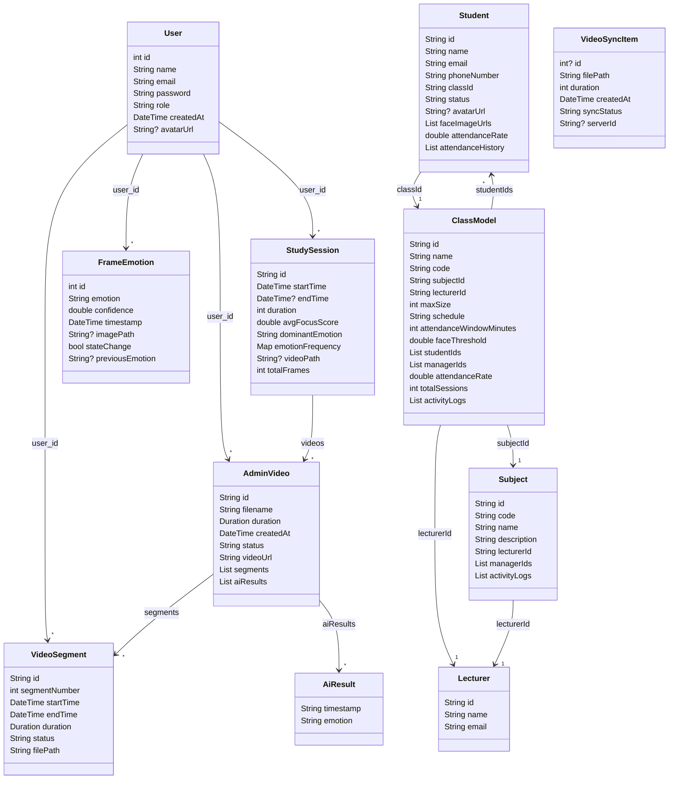

# Class Diagram dự án

## Sơ đồ lớp chính

## Chức năng chính và chức năng con

1. Quản lý người dùng
   - Đăng ký / đăng nhập
   - Quản lý profile
   - Phân quyền user / student / lecturer / admin

2. Quản lý đào tạo
   - Quản lý môn học (`Subject`)
   - Quản lý lớp học (`ClassModel`)
   - Quản lý sinh viên (`Student`)
   - Gán giảng viên (`Lecturer`) cho môn học và lớp học

3. Giám sát và phân tích video
   - Tải video lên và xử lý (`AdminVideo`, `VideoSegment`)
   - Trích xuất đoạn video, phân đoạn và trạng thái xử lý
   - Phân tích cảm xúc từ khung hình (`FrameEmotion`)

4. Theo dõi buổi học / học tập
   - Lưu lịch sử phiên học (`StudySession`)
   - Tính điểm tập trung, cảm xúc chiếm ưu thế
   - Hiển thị thống kê session và chart

5. Đồng bộ và lưu trữ cục bộ
   - Lưu video cục bộ và theo dõi trạng thái đồng bộ (`VideoSyncItem`)
   - Quản lý trạng thái offline / uploading / synced / failed

## Lưu ý

- `Post` là mô hình test API và không phải bảng chính của hệ thống.
- `VideoSyncItem` là bảng local SQLite dùng cho chức năng đồng bộ video cục bộ.
- `FrameEmotion` và `VideoSegment` là phần lõi cho việc phân tích hành vi, tập trung và cảm xúc.
